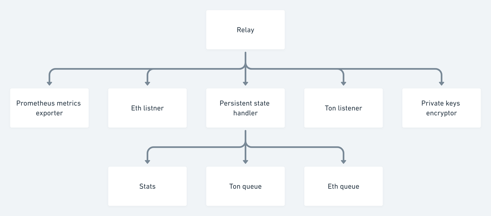
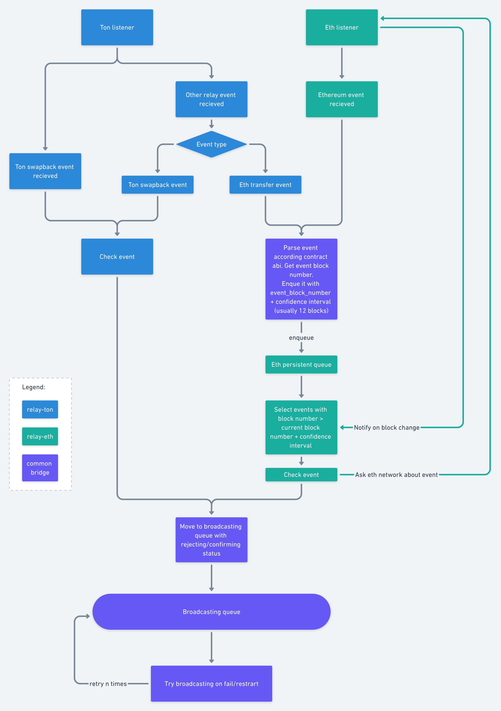

# ETH-to-TON relay

## Security

On first launch, user provides seed phrases for ton and ethereum and password,
with which them will be encrypted. We
use [xsalsa20poly1305](http://nacl.cr.yp.to/valid.html) for encryption
and [PBKDF2](https://nvlpubs.nist.gov/nistpubs/Legacy/SP/nistspecialpublication800-132.pdf)
for user password derivation.

## Reliability

In case of panic, we flush all the state to disk. In normal conditions state is
periodically flushed on disk. In case of network error we retry to get/send
data. We are using http and polling instead of websockets due to impossibility
to detect the disconnect and save state for every processed block.

## How it works

There are two significant parts. TON → ETH and ETH → TON.

### ETH -> TON

Relay subscribes on address, specified in `bridge_contract_address`. Here it
obtains list of known config addresses. We subscribe on each config in this
list. Each config contract gives as configuration and stream of events in case
of config change.

Each config has ethereum address + abi + `blocks_to_confirm` constant + some
additional data.

Then we subscribe on ethereum events from the last block in ethereum, using abi
and addresses, got on the previous step. If the relay has ever started, then we
restore state in  [Persistent state](#persistent-state) section.

We enqueue each received ethereum event in the persistent queue. On each
processed block in ethereum we check, if any prepared events in queue are should
be broadcast(block number of enqueued event is equal or less than processed
block number +`blocks_to_confirm` and required number of votes for this event
has not been collected).

For each event received from other relays we check it validity.

### TON -> ETH

Subscribe on events in bridge contract. Get ton event contract. Get event proxy
address from it.  
Subscribe on event proxy. For each event got from proxy check event correctness,
pack it according to [conversion scheme](CONTRACTS.md). Sign it and send to
event contract.

You can read more about
contracts [here](https://github.com/broxus/ton-eth-bridge-contracts/tree/master/docs)
.

## Persistent state.

- We use embedded key value db for persistent storage and queuing.
- Every processed block in ethereum is written into db, to restore state after a
  shutdown.
- Every event from ethereum is enqueued into the db and moved to another queue
  when conditions are met.
- Every ton transaction is put to the persistent queue and move from it to
  confirmed table when we see confirmation for it.
- We resend all pending transactions after relay restart
- All transfers between queues are atomic.
